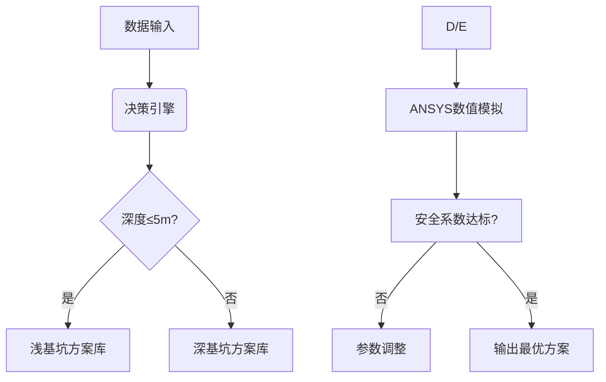

# 基坑支护方案选择器框架设计

## 一、功能设计
### 1.1 核心功能
- **数据输入模块**
  - 基坑参数：深度/尺寸/形状
  - 地质条件：土层类型/地下水位/承载力
  - 环境参数：周边建筑/管线分布/交通流量
  - 施工要求：工期/设备限制/成本预算

- **方案匹配引擎**
  - 多级嵌套决策树：
    ```
    基坑深度 ≤5m → 土钉墙/钢板桩
    5m<深度≤10m → 桩锚支护/地下连续墙
    深度>10m → 复合土钉墙+内支撑
    ```
  - 环境敏感区自动触发隔水帷幕选项
  - 软土地基强制启动变形监测方案

- **循环验证系统**
  - 稳定性校核：抗倾覆/抗隆起/整体滑移
  - 经济性复核：材料成本/工期损耗比对
  - 可行性检查：设备进场路径模拟

- **结果输出界面**
  - 三维支护结构可视化
  - 施工工序动画演示
  - 材料清单自动生成
  - 风险预警报告（PDF/Excel）

### 1.2 使用场景
- **工地现场快速决策**：支持移动端离线使用
- **设计院方案比选**：多方案并行模拟分析
- **监理单位审查**：规范条文自动关联核查
- **教学培训应用**：典型工程案例库调用

## 二、理论分析
### 2.1 力学计算模型
- **土压力理论**
  - 朗肯主动/被动土压力计算
  - 考虑水土分算/合算模式
  - 超载影响系数修正

- **稳定性分析**
  ```math
  安全系数F_s = \frac{\sum抗滑力}{\sum滑动力} ≥1.3
  ```
  - 圆弧滑动法（瑞典条分法）
  - 基坑隆起量预测模型

- **结构设计理论**
  - 支护桩配筋计算
  - 锚索预应力损失补偿
  - 支撑体系刚度矩阵分析

### 2.2 决策逻辑架构
- **模糊综合评价**
  - 构建指标集：{安全性,经济性,可实施性}
  - 权重分配：AHP层次分析法
  - 建立隶属度函数矩阵

- **案例推理机制**
  - 特征向量：{深度,土质,环境敏感度}
  - 相似度计算：欧式距离法
  - 案例修正规则库

## 三、技术路线
### 3.1 系统架构


### 3.2 关键技术
- **多源数据融合**
  - BIM模型接口开发
  - 地质雷达数据解析
  - 物联网传感器实时接入

- **智能优化算法**
  - 遗传算法参数寻优
  - 蒙特卡洛风险模拟
  - 数字孪生虚实映射

- **人机交互设计**
  - AR增强现实现场标注
  - 语音指令控制系统
  - 多语言自动切换

### 3.3 开发栈选型
| 模块        | 技术方案                  |
|-------------|-------------------------|
| 前端        | React+Three.js          |
| 后端        | Python(Django)+ABAQUS API |
| 移动端      | Flutter+ARKit           |
| 数据库      | PostgreSQL+Redis        |
| 可视化      | WebGL+Echarts           |
